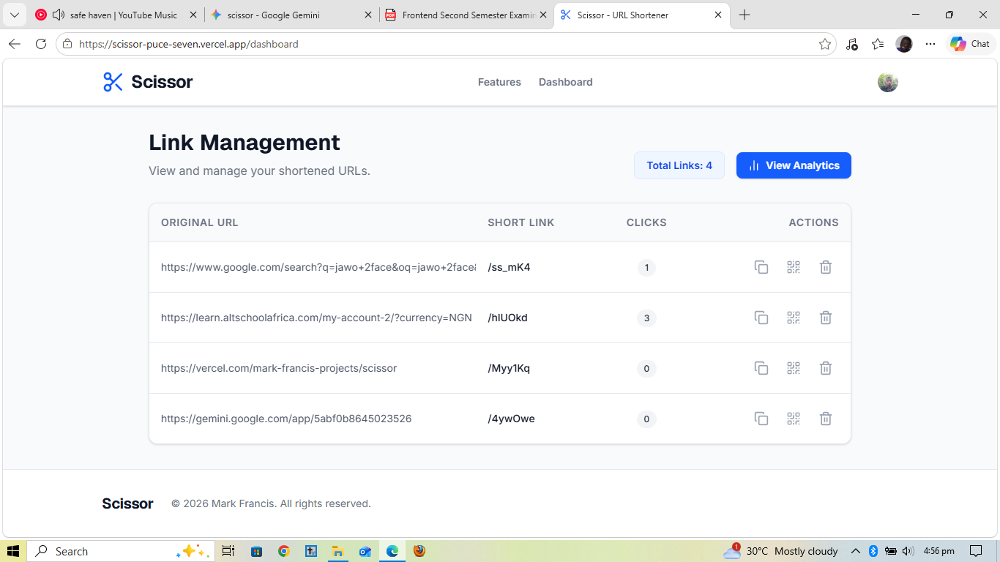
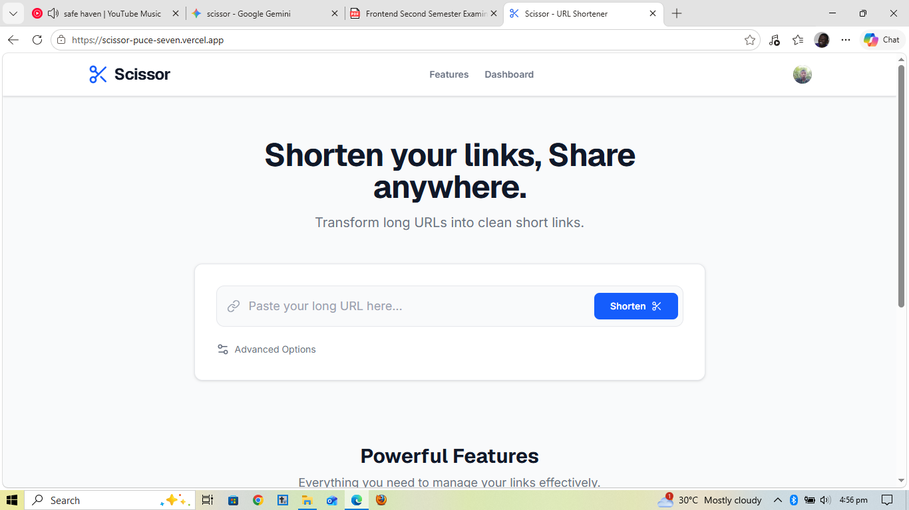
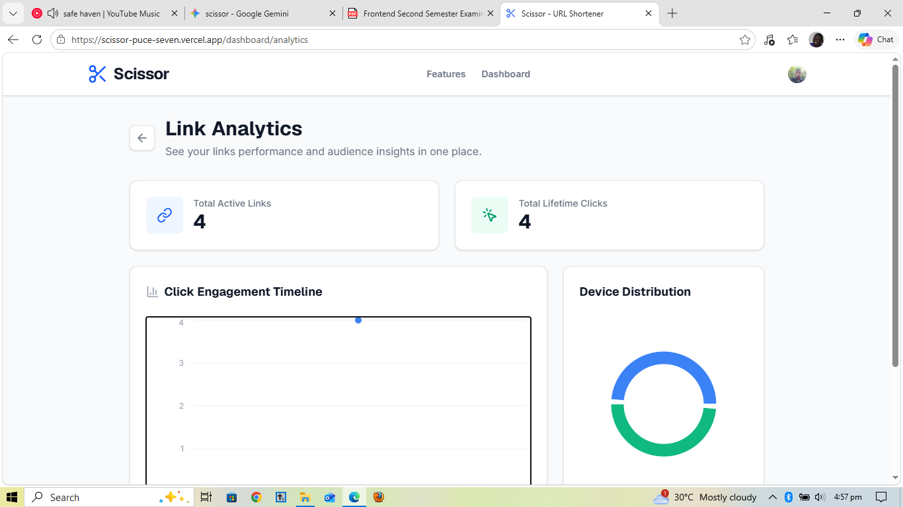

# Scissor - Modern URL Shortener & Analytics Platform

**Scissor** is a high-performance, full-stack URL management platform designed to transform long, complex URLs into clean, branded links. The application provides instant redirects, secure user isolation, dynamic QR code generation, and granular click tracking via an interactive analytics dashboard.

**Live Application:** [View Live Deployment](https://https://scissor-puce-seven.vercel.app)

---

## Project Description & Features

Scissor handles high-frequency link distribution and metric tracking. Standard long URLs clutter messaging channels and provide no insights into user engagement. Scissor acts as a smart proxy—storing URL mappings securely, intercepting incoming traffic at the edge, silently tracking click metadata, and redirecting users instantly.

### Core Features

- **Authentication & Multi-Tenancy:** Secure user accounts and isolated dashboards powered by Clerk.
- **Deterministic Link Generation:** Generation of short links using collision-free random hashing or custom, user-defined vanity slugs.
- **Granular Analytics:** Real-time click counter increments combined with time-series charts displaying engagement over time and device-type distribution (Mobile vs. Desktop).
- **Dynamic QR Code Synthesis:** Real-time vector QR code generation for every active short link, enabling seamless cross-channel offline marketing.
- **Link Lifecycle Control:** Optional time-based expiration policies to auto-retire links after promotional periods conclude.
- **Smart Redirects:** Fast middleware that routes users to their destination without loading the application UI, complete with a "410 Gone" fallback for expired links.

---

## Platform Screenshots

### 1. Unified Dashboard Layout

Provides users with quick access to form shortening engines and contextual overview summaries. Switches fluidly between desktop grid configurations and localized mobile cards depending on screen dimensions.



### 2. Smart Link Generation

A streamlined interface for generating random short codes or creating custom vanity slugs, complete with real-time validation and expiration settings.



### 3. Live Time-Series Analytics

Visualizes data points pulled dynamically from backend tracking engines using Recharts components, adjusting chart parent frames safely to fit inside small-screen boundaries.



---

## Technology Choices and Reasoning

The architecture was intentionally selected to optimize for low latency during URL lookups (reads) while maintaining high agility during feature implementation (writes):

- **React + Vite:** Chosen for frontend rendering due to its lightning-fast Hot Module Replacement (HMR) during development. Running as a Single Page Application (SPA) allows smooth layout morphs (like switching between table and card states on mobile) without triggering expensive browser page repaints.
- **Tailwind CSS:** Utilized to build a custom responsive layout without bulky UI component frameworks. Its mobile-first utility paradigm allowed quick adjustment of font layouts and flex behaviors to eliminate viewport containment issues across variable mobile widths.
- **Convex Cloud:** Selected as the backend and database layer. Convex replaces traditional server architecture with serverless operations and automatic caching. Redirection handling requires maximum speed; Convex mutations fetch data with zero driver overhead.
- **Clerk Auth:** Integrated to handle enterprise-level user lifecycle management. Delegating auth validation to Clerk offloads security vectors (session hijacking, password hashing protection) to dedicated infrastructure.

---

## Setup Instructions

Follow these steps to spin up a fully local instance of the application with live database synchronizations.

### Prerequisites

- Node.js (v18.x or higher)
- Npm (v9.x or higher)
- Active developer accounts on Clerk and Convex Cloud

### 1. Clone & Install

```bash
git clone [https://github.com/frankosivue/scissor.git](https://github.com/frankosivue/scissor.git)
cd scissor
npm install
```

## Future Improvements Roadmap

1. work on the referrer feature
2. Redesign the UI to be better
3. Remove clerk dev banner from the auth page to make it more SAS like
